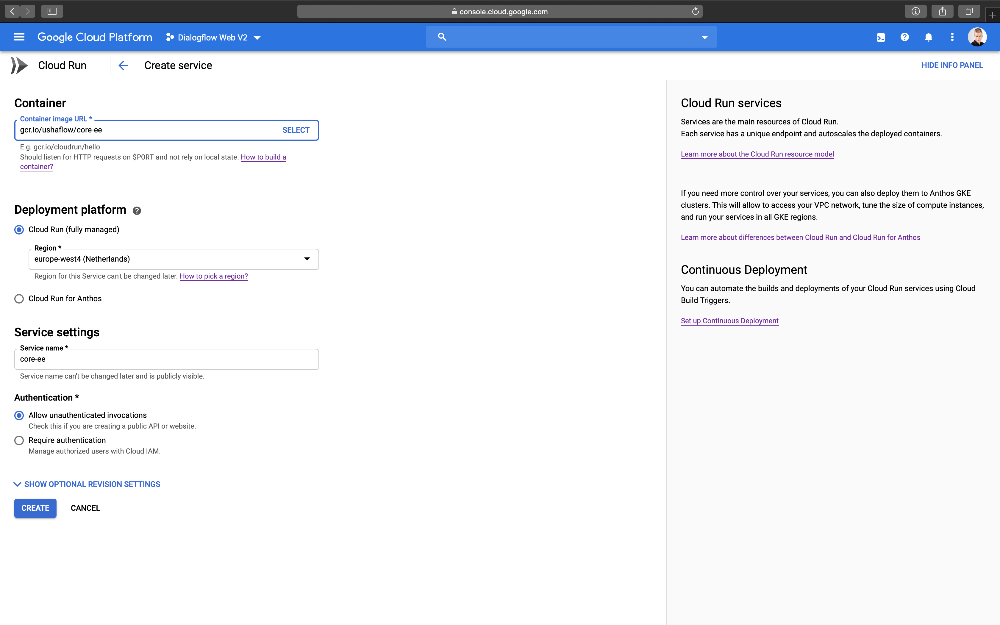
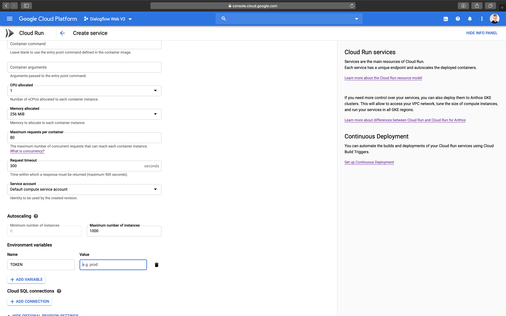
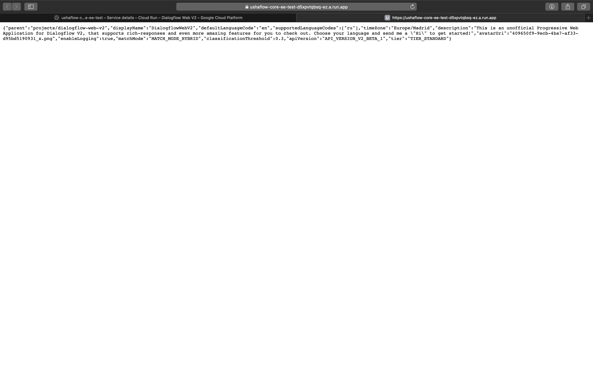

# Cloud Run

Open [Cloud Run console](https://console.cloud.google.com/run) and select the Project with your Agent

Press on "Create service"


Enter following container image URL

```text
ghcr.io/ushaflow/core-ee
```

Select the deployment platform and region  
Choose "Allow unauthenticated invocations" in the "Authentication" section



Press on "Show optional revision settings"

In the "Environment variables" section, add desired [configuration options](../configuration/)



Press on "Create"


Visit the given URL to check everything works



