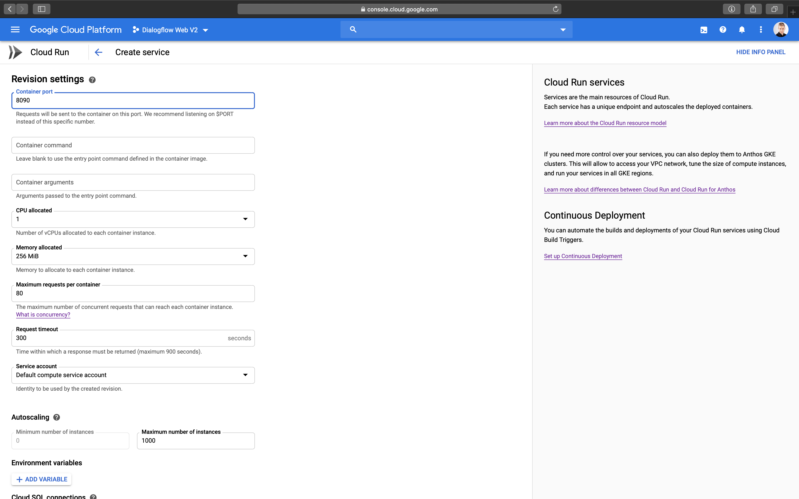

# Ushaflow Core EE: Installation

## Using Google Cloud Run

Simplest, fastest and cheapest way to run Ushaflow Core EE is using [Google Cloud Run](https://cloud.google.com/run)

1. Open [Cloud Run console](https://console.cloud.google.com/run) and select the Project with your Dialogflow Agent
2. Press on "Create service" and enter the container image URL
   `gcr.io/ushaflow/core-ee`

   

3. Select deployment platform and region
4. Choose "Allow unauthenticated invocations" in the "Authentication" section
5. Press on "Show optional revision settings"
6. Set the "Container port" to `8090`

   

8. In the "Environment variables" section, press on "Add variable"
9. Add `TOKEN` environment variable containing your License Key

   

10. Press on "Create"

    

11. Visit the provided URL to check everything is working

    
