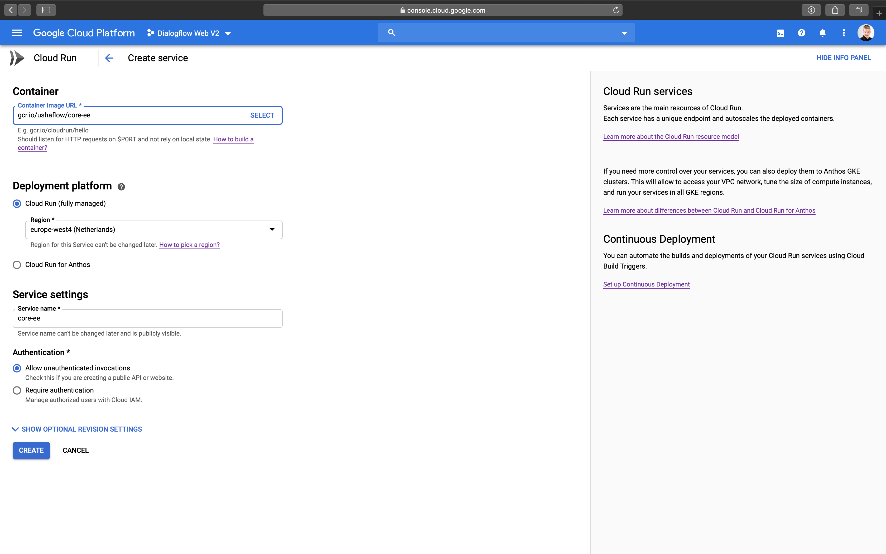
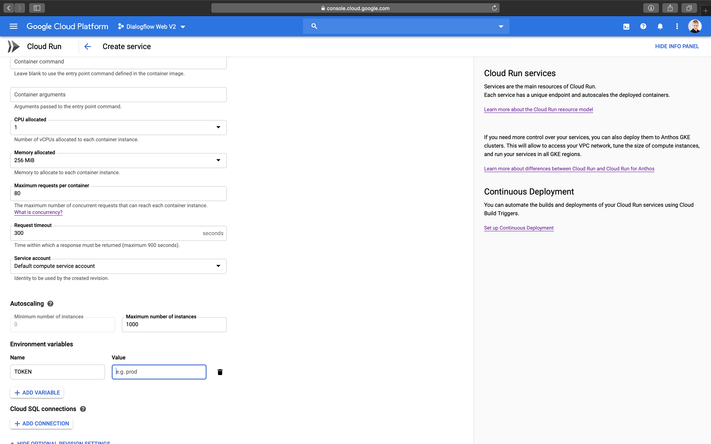
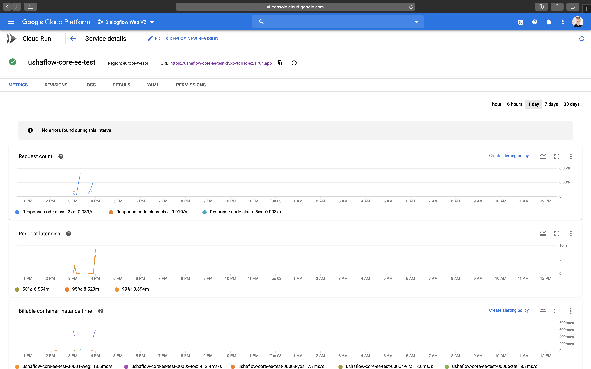
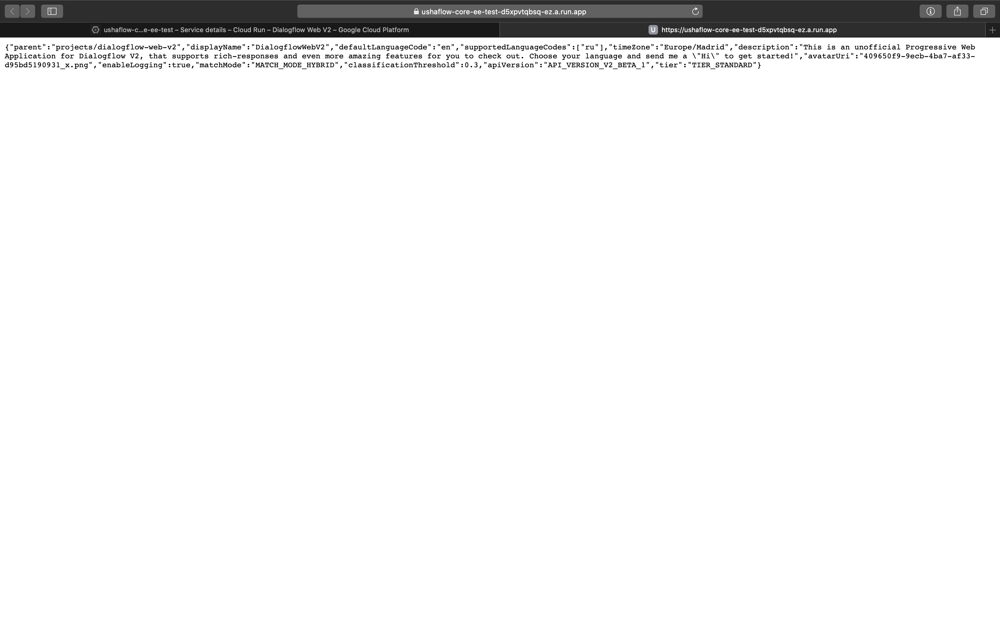

# Ushaflow Core EE: Installation

## Environments

- [Cloud Run](#cloud-run)
- [App Engine Flexible](#app-engine-flexible)
- [Kubernetes](#kubernetes)
- [Docker](#docker)

## Cloud Run

1. Open [Cloud Run console](https://console.cloud.google.com/run) and select the Project with your Dialogflow Agent
2. Press on "Create service"
3. Enter following container image URL

   ```
   gcr.io/ushaflow/core-ee
   ```

4. Select the deployment platform and region
5. Choose "Allow unauthenticated invocations" in the "Authentication" section

   

6. Press on "Show optional revision settings"
7. In the "Environment variables" section, add desired [configuration options](./configuration.md)

   

8. Press on "Create"

   

9. Visit the given URL to check everything is working

   

## App Engine Flexible

1. Make sure you have [Google Cloud SDK](https://cloud.google.com/sdk/docs) installed
2. Create an App Engine application

   ```
   gcloud app create
   ```

3. Make and enter a new directory for your App Engine application

   ```
   mkdir core-ee && cd core-ee
   ```

4. Create `app.yaml` and add desired [configuration options](./configuration.md) to the `env_variables` field

   ```yaml
   runtime: custom
   env: flex
   env_variables:
    # your environment variables go here
   ```

5. Create a `Dockerfile`

   ```Dockerfile
   FROM gcr.io/ushaflow/core-ee
   ```

6. Deploy your app

   ```
   gcloud app deploy
   ```

7. See your app running

   ```
   gcloud app browse
   ```

## Kubernetes

1. Make sure you have [Google Cloud SDK](https://cloud.google.com/sdk/docs) installed
2. Create a Service Account

   ```
   gcloud iam service-accounts create ushaflow-core-ee
   ```

3. Grant `dialogflow.reader` and `dialogflow.client` roles to the Service Account

   ```
   gcloud projects add-iam-policy-binding <your-project-id> --member serviceAccount:ushaflow-core-ee@<your-project-id>.iam.gserviceaccount.com --role roles/dialogflow.client
   ```

   ```
   gcloud projects add-iam-policy-binding <your-project-id> --member serviceAccount:ushaflow-core-ee@<your-project-id>.iam.gserviceaccount.com --role roles/dialogflow.reader
   ```

4. Generate Service Account key

   ```
   gcloud iam service-accounts keys create service_account.json --iam-account ushaflow-core-ee@<your-project-id>.iam.gserviceaccount.com
   ```

5. Using `kubectl` create a `Secret` ressource, containing the service account key

   ```
   kubectl create secret generic ushaflow-core-ee --from-file=service_account.json
   ```

6. Create a `ConfigMap` containing desired [configuration options](./configuration.md)

   ```yaml
   apiVersion: v1
   kind: ConfigMap
   metadata:
    name: ushaflow-core-ee
   data:
    TOKEN: <your license key>
    GOOGLE_APPLICATION_CREDENTIALS: /app/service_account.json
   ```

7. Create a `Deployment` contaning the container

   ```yaml
   apiVersion: extensions/v1beta1
   kind: Deployment
   metadata:
     name: ushaflow-core-ee
   spec:
     selector:
       matchLabels:
         app: ushaflow-core-ee
     template:
       metadata:
         labels:
           app: ushaflow-core-ee
       spec:
         containers:
         - name: ushaflow-core-ee
           image: gcr.io/ushaflow/core-ee
           envFrom:
           - configMapRef:
               name: ushaflow-core-ee
           volumeMounts:
             - name: service-account
               subPath: service_account.json
               mountPath: /app/service_account.json
               readOnly: true
         volumes:
           - name: service-account
             secret:
               secretName: ushaflow-core-ee
   ```

8. Expose the `Deployment` using a `Service`

   ```yaml
   apiVersion: v1
   kind: Service
   metadata:
     name: ushaflow-core-ee
   spec:
     selector:
       app: ushaflow-core-ee
     ports:
     - name: http
       targetPort: 8090
       port: 80
   ```

9. Expose the `Service` using `Ingress`

   ```yaml
   apiVersion: extensions/v1beta1
   kind: Ingress
   metadata:
     name: ushaflow-core-ee
   spec:
     rules:
     - host: example.com
       http:
         paths:
         - path: /
           backend:
             serviceName: ushaflow-core-ee
             servicePort: http
   ```

## Docker

1. Make sure you have [Google Cloud SDK](https://cloud.google.com/sdk/docs) installed
2. Create a Service Account

   ```
   gcloud iam service-accounts create ushaflow-core-ee
   ```

3. Grant `dialogflow.reader` and `dialogflow.client` roles to the Service Account

   ```
   gcloud projects add-iam-policy-binding <your-project-id> --member serviceAccount:ushaflow-core-ee@<your-project-id>.iam.gserviceaccount.com --role roles/dialogflow.client
   ```

   ```
   gcloud projects add-iam-policy-binding <your-project-id> --member serviceAccount:ushaflow-core-ee@<your-project-id>.iam.gserviceaccount.com --role roles/dialogflow.reader
   ```

4. Generate Service Account key

   ```
   gcloud iam service-accounts keys create service_account.json --iam-account ushaflow-core-ee@<your-project-id>.iam.gserviceaccount.com
   ```

5. Run the container with desired [configuration options](./configuration.md)

   ```
   docker run -d \
   -e "TOKEN=<your license key>" \
   -e "GOOGLE_APPLICATION_CREDENTIALS=/app/service_account.json" \
   -p 8090:8090 \
   -v "$(pwd)"/service_account.json:/app/service_account.json \
   gcr.io/ushaflow/core-ee
   ```